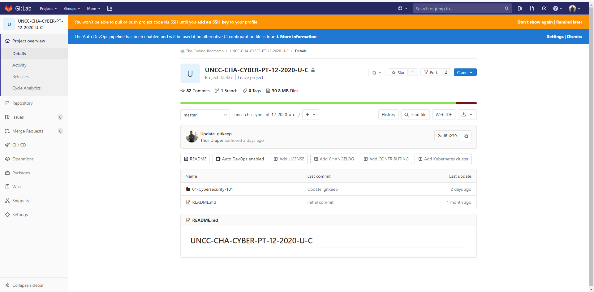
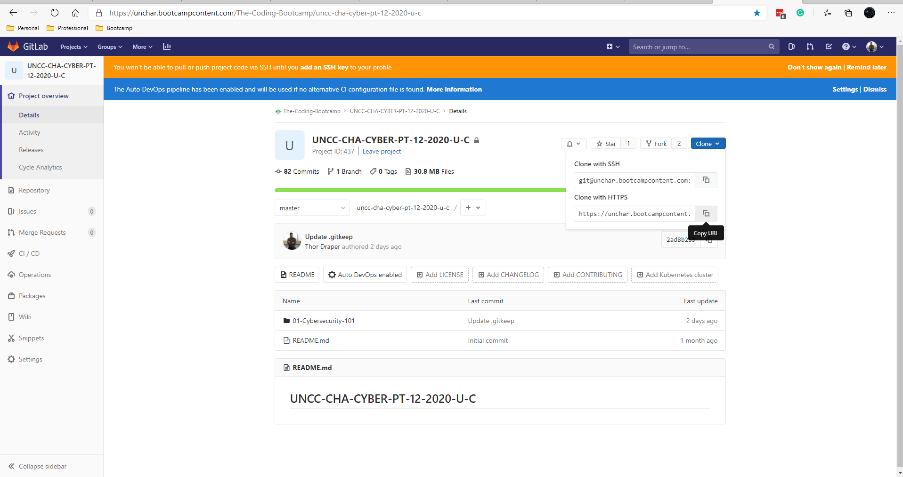
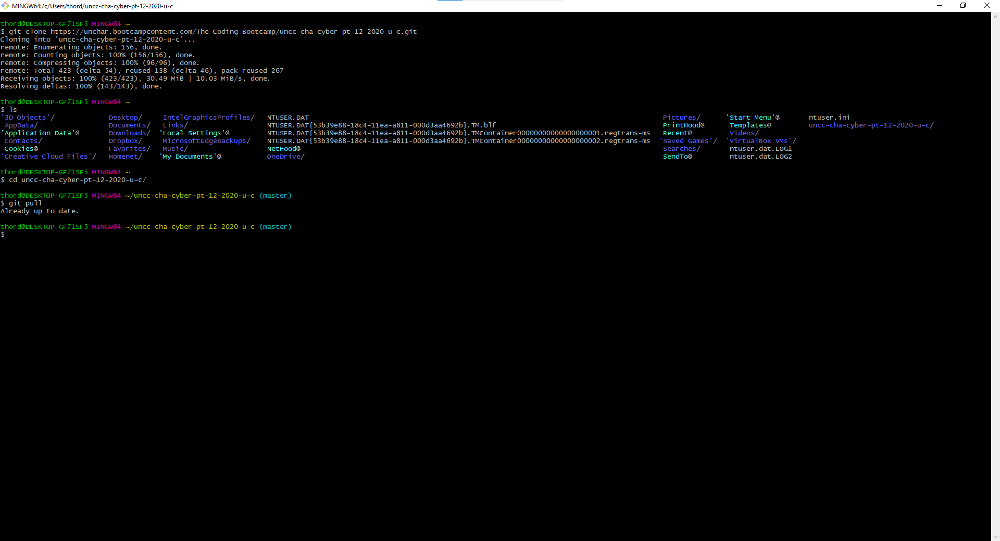

# GitBash

## What is Git?

Git is a distributed version-control system for tracking changes in any set of files, originally designed for coordinating work among programmers cooperating on source code during software development. Its goals include speed, data integrity, and support for distributed, non-linear workflows.

[Official GitHub Guides](https://guides.github.com/)

**Thor's Definition:** The git command is a tool that checks on versions of a single repository.  

## Primary Commands

* **`git pull`** The most common command you're going to use is `git pull`. Since we update the GitHub repository every class you'll use `git pull` to download the updated files. The nice thing is that because you are using `git` you'll only download the files that you didn't already have stored locally on your machine.

* **`git add`** Adds new or changed files in your working directory to the `git` staging area

* **`git commit`** If you were to make any changes (add, edit, or delete) commits keep track of your changes. This creates a version history for your repository

* **`git push`** Once a commit is ready you can push your changes into production

## Setting up your class repository

### Step 1

Navigate to out GitLab repository


### Step 2

Press clone and copy the HTTPS link


### Step 3

Start GitBash


### Step 4

Enter

```git
git clone <URL_LINK_FROM_REPO>
```

'Expected Outcome'

```git
Cloning into 'REPO_NAME'...
remote: Enumerating objects: 156, done.
remote: Counting objects: 100% (156/156), done.
remote: Compressing objects: 100% (96/96), done.
remote: Total 423 (delta 54), reused 138 (delta 46), pack-reused 267
Receiving objects: 100% (423/423), 30.49 MiB | 10.03 MiB/s, done.
Resolving deltas: 100% (143/143), done.

```

### Step 5

Verify that the "REPO_NAME" folder downloaded

```git
ls
```

### Step 6

Navigate to the directory

```git
cd 'REPO_NAME'
```

### Step 7

Verify that you have the most recent version of our GitLab repository

```git
git pull
```

'The expected result is' “Already up to date.”


## Adding your credentials

### The 'git config' command

* To add your username:
  * `git config --global credential.username "thor-draperjr"`
* To add your password:
  * `git config --global credential.helper store`

## Common Issues

### Mac's

'Install developer tools'

Try this [link](https://mac-how-to.gadgethacks.com/how-to/install-command-line-developer-tools-without-xcode-0168115/#:~:text=%20Install%20the%20Command%20Line%20Developer%20Tools%20Without,the%20Waiting%20Game.%20Now%2C%20you%20just...%20More%20)
