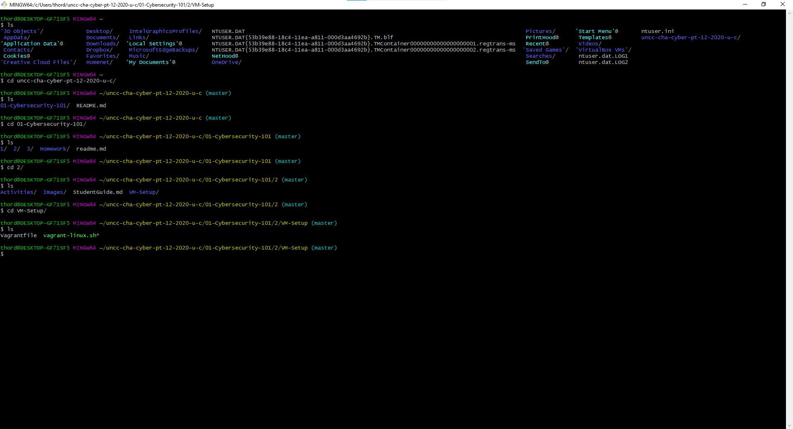
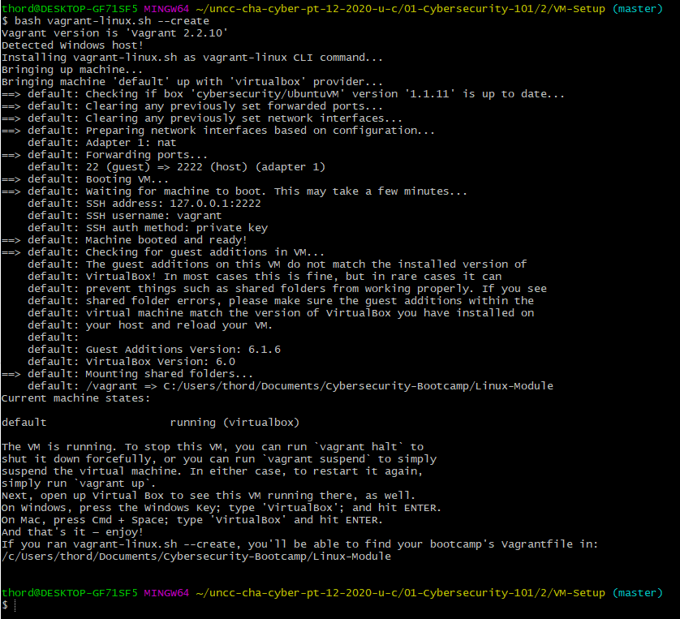
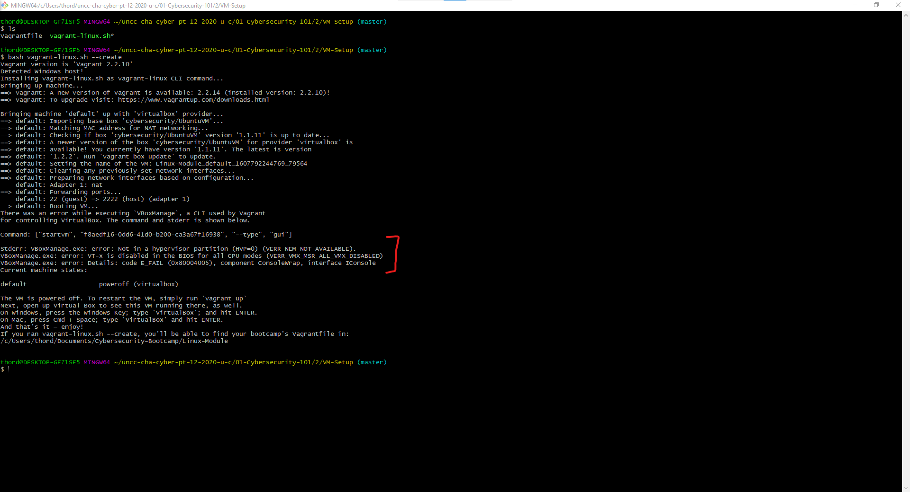

# Objective

## What is Vagrant
Vagrant is an open-source software product for building and maintaining portable virtual software development environments; e.g., for VirtualBox, KVM, Hyper-V, Docker containers, VMware, and AWS. It tries to simplify the software configuration management of virtualizations in order to increase development productivity. 
## Terms
* **sudo**: super user do
* **bash**: this is a shell for executing scripts
* **Virtualization**: Virtualization creates a simulated, or virtual, computing environment as opposed to a physical environment. Virtualization often includes computer-generated versions of hardware, operating systems, storage devices, and more. This allows organizations to partition a single physical computer or server into several virtual machines. Each virtual machine can then interact independently and run different operating systems or applications while sharing the resources of a single host machine.


## Updating Vagrant
1. Run vagrant global-status --prune to find the locations of all Vagrant machines. 
2. Navigate to the directory where the machine is installed with cd $HOME/Documents/3. Cybersecurity-Bootcamp/Linux-Module (this directory may be different depending on your class's setup).
3. Check for machine updates with vagrant box update.
4. Shut down the current VM, if it's running, with vagrant destroy.
5. Load the new virtual machines with vagrant up.
6. Optionally, remove outdated Vagrant base boxes with vagrant box prune.

## Installing Vagrant
1. Verify you're in the right directory
```
ls
```

2. Run the following commands
### Windows`
```
bash vagrant-linux.sh --create
```
### Mac
```
sudo bash vagrant-linux.sh --create
```



## Common issues:
### Virutalizaion not turned on in the BIOS

#### If you see this error ####
This means that you don't have virutlaiztion turned on in the BIOS. Take a look at this [documentation](https://helpdeskgeek.com/how-to/enable-virtualization-in-the-bios/)


### 404
There is a way to pin the version number, we believe the 1.2.5 version should work fine so if this has become a blocker, modify the Vagrantfile like so:

```sh
# -*- mode: ruby -*-
# vi: set ft=ruby :
Vagrant.configure("2") do |config|
  config.vm.box = "cybersecurity/UbuntuVM"
  config.vm.box_version = "1.2.5"
  config.vm.provider "virtualbox" do |vb|
    # Display the VirtualBox GUI when booting the machine
    # Uncomment ONE the lines below to control how much RAM Vagrant gives the VM
    # We recommend starting with 4096 (4Gb), and moving down if necessary
    # vb.memory = "1024" # 1Gb
    # vb.memory = "2048" # 2Gb
    # vb.memory = "4096" # 4Gb
    vb.gui = true
  end
end
```
**Note that what you are doing is adding this line:**
`config.vm.box_version = "1.2.5"`

It's also important to note that by pinning this version, you will not be able to get updates until you remove that line from the Vagrantfile.

### S mode
To uninstall 

To turn off Windows 10 S Mode, click the Start button then go to Settings > Update & Security > Activation. Select Go to the Store and click Get under the Switch out of S Mode panel.

### Two versions of Vagrant installed
`C:/HashiCorp/Vagrant/embedded/gems/2.2.16/gems/ed25519-1.2.4/lib/ed25519.rb:13: warning: already initialized constant Ed25519::KEY_SIZE`

Check in your programs to be sure that there is only a single install of Vagrant.

### Install on the wrong drive
`Failed to load R0 module D:\/VMMR0.r0: The path is not clean of leading double slashes: 'D:\/VMMR0.r0' (VERR_SUPLIB_PATH_NOT_CLEAN).`

Make sure that the install is on the C:\ on your machine.